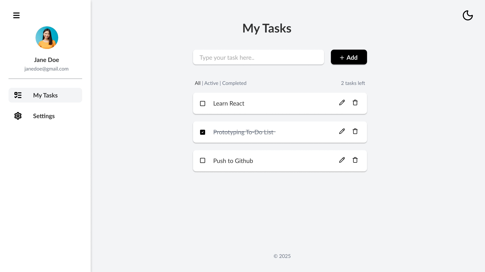
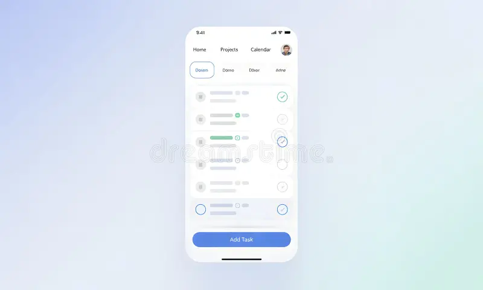
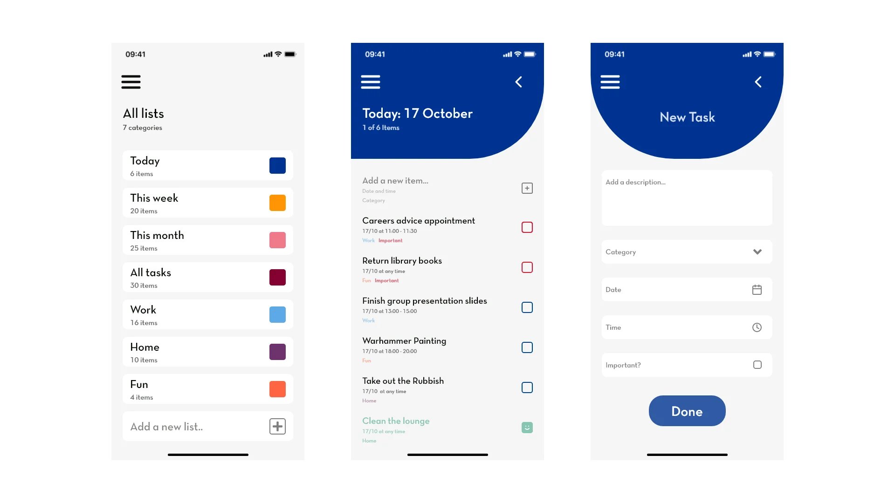

# 📝 Gestor de Tareas — Proyecto Integrador Frontend

> **Fecha de entrega:** Martes 10/03/2026  
> **Tipo:** Proyecto Integrador — Frontend  
> **Materia:** Desarrollo Frontend  

---

## 📌 Descripción del Proyecto

Aplicación web de gestión de tareas personales desarrollada como proyecto integrador de la materia de Frontend. Permite al usuario crear, editar, completar y eliminar tareas, con persistencia de datos mediante `localStorage`.

La solución fue diseñada con un enfoque minimalista y limpio, priorizando la usabilidad y la experiencia de usuario tanto en escritorio como en dispositivos móviles.

---

## 🎯 Problemática a Resolver

Muchas personas tienen dificultades para organizar sus actividades diarias de forma efectiva. Este gestor de tareas ofrece una solución simple, rápida y accesible desde el navegador, sin necesidad de registro ni conexión a internet.

---

## 🖼️ Diseño — Wireframes y Referencias Visuales

El diseño de la aplicación se basó en los siguientes wireframes y referencias de UI:

### Vista Desktop


Interfaz con barra lateral de navegación, perfil de usuario, lista de tareas con checkboxes, edición y eliminación inline, y filtros (Todas / Activas / Completadas).

### Vista Mobile


Adaptación mobile con navegación superior, tarjetas de tarea con progreso visual y botón flotante de acción (FAB) para agregar nuevas tareas.

### Opciones de diseño adicionales


Referencias de diseño con múltiples vistas: lista de categorías, detalle de tareas del día y formulario de nueva tarea.

---

## 🎨 Sistema de Diseño

| Elemento | Valor |
|---|---|
| **Fuente principal** | Roboto (400, 500) |
| **Fuente alternativa** | Inter (400, 500) |
| **Color de fondo** | `#FFFFFF` |
| **Color de superficie** | `#FAFAFA` |
| **Texto principal** | `#212121` |
| **Texto secundario** | `#757575` |
| **Acento / Primario** | `#2196F3` |
| **Éxito / Completado** | `#4CAF50` |
| **Borde** | `#E0E0E0` |
| **Border radius** | `8px` |
| **Estilo general** | Minimalismo alto — solo lo esencial |

---

## ✅ Requerimientos de la Primera Entrega (10/03/2026)

- [x] **1. Wireframes / imágenes del diseño** — incluidas en `/assets/`
- [x] **2. HTML, CSS y JS** — estructura, estilos y lógica concordantes con los diseños
- [x] **3. Solución funcional con `localStorage`** — persistencia de datos sin backend

---

## ⚙️ Funcionalidades

- ➕ Agregar nueva tarea
- ✏️ Editar tarea existente
- ✅ Marcar tarea como completada (con tachado visual)
- 🗑️ Eliminar tarea
- 🔍 Filtrar tareas: **Todas | Activas | Completadas**
- 💾 Persistencia de datos con `localStorage`
- 🌙 Toggle de modo oscuro / claro
- 📱 Diseño responsive (desktop y mobile)

---

## 🗂️ Estructura del Proyecto

```
gestor-tareas/
├── index.html          # Estructura principal de la app
├── css/
│   └── styles.css      # Estilos y variables de diseño
├── js/
│   └── app.js          # Lógica de la aplicación y manejo de localStorage
├── assets/
│   ├── base-design.jpg
│   ├── dase-design-mobile.webp
│   └── more-design-option.webp
└── README.md
```

---

## 🚀 Cómo Ejecutar

1. Clonar o descargar el repositorio
2. Abrir `index.html` directamente en el navegador
3. No requiere instalación ni servidor — funciona 100% en el cliente

```bash
# Opcionalmente, con Live Server (VS Code):
# Clic derecho en index.html → "Open with Live Server"
```

---

## 🛠️ Tecnologías Utilizadas

| Tecnología | Uso |
|---|---|
| **HTML5** | Estructura semántica |
| **CSS3** | Estilos, variables CSS, Flexbox, Grid |
| **JavaScript (ES6+)** | Lógica, DOM, eventos |
| **localStorage** | Persistencia de datos en el navegador |
| **Google Fonts — Roboto** | Tipografía principal |

---

## 👤 Autor

[**Estudiante:**](https://github.com/luisda-291105/gestor-tareas)
**Materia:** Desarrollo Frontend II
**Año:** 2026  

---

## 📄 Licencia

Proyecto de uso académico — Proyecto Integrador Escolar.