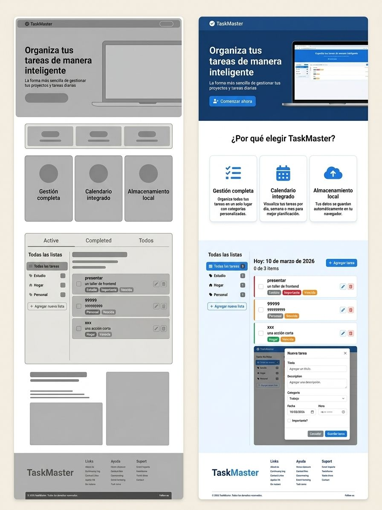
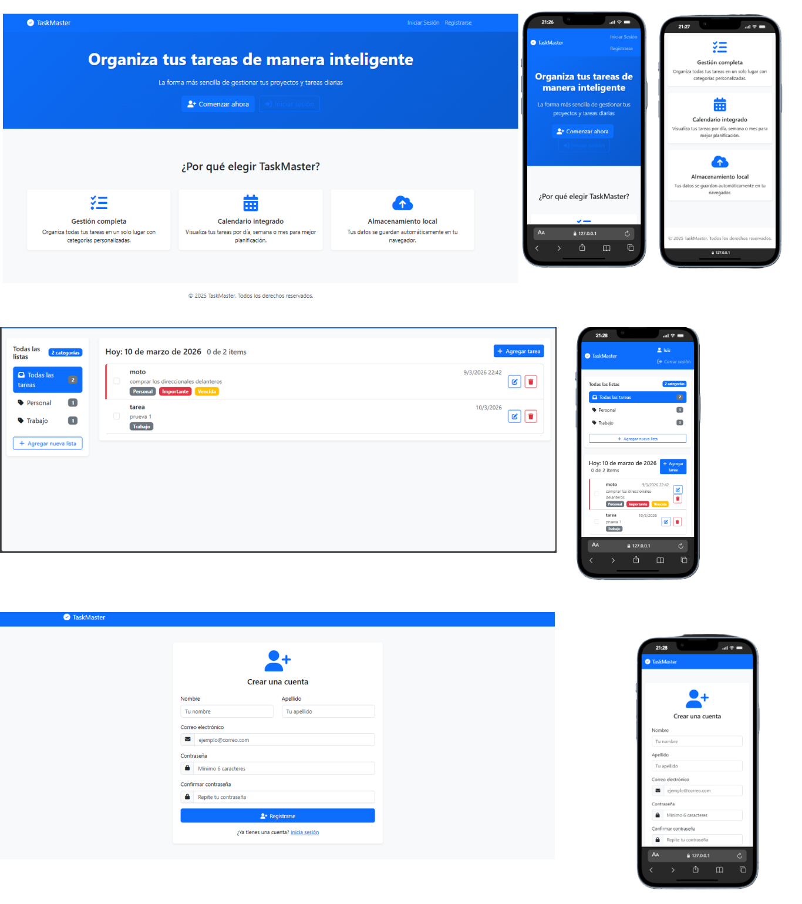

# 📝 Gestor de Tareas — Proyecto Integrador Frontend

> **Fecha de entrega:** Martes 10/03/2026  
> **Tipo:** Proyecto Integrador — Frontend  
> **Materia:** Desarrollo Frontend  

---

## 📌 Descripción del Proyecto

Aplicación web de gestión de tareas personales desarrollada como proyecto integrador de la materia de Frontend. Permite al usuario crear, editar, completar y eliminar tareas, con persistencia de datos mediante `localStorage`.

La solución fue diseñada con un enfoque minimalista y limpio, priorizando la usabilidad y la experiencia de usuario tanto en escritorio como en dispositivos móviles.

---

## 🎯 Problemática a Resolver

Muchas personas tienen dificultades para organizar sus actividades diarias de forma efectiva. Este gestor de tareas ofrece una solución simple, rápida y accesible desde el navegador, sin necesidad de registro ni conexión a internet.

---

## 🖼️ Diseño — Wireframes y Referencias Visuales

El diseño de la aplicación se basó en los siguientes wireframes y referencias de UI:

### Wireframe y Diseño Final


Wireframe de la estructura general de la app: landing page con hero section, sección de características, vista del gestor de tareas con sidebar de listas y categorías, modal de nueva tarea, y footer. Incluye la versión final del diseño con colores, tipografía y componentes definitivos.

### Diseño Final — Vistas Desktop y Mobile


Diseño completo de la aplicación: landing page responsive, vista del gestor de tareas con lista de tareas del día, etiquetas de categorías y prioridad, y vistas de registro de usuario — tanto en desktop como adaptadas para dispositivos móviles.

---

## 🏗️ Arquitectura del Proyecto

### Descripción de módulos

**`root/`** — Punto de entrada de la app:
- `index.html` — vista principal del gestor de tareas
- `login.html` — vista de inicio de sesión
- `register.html` — vista de registro de usuario
- `script.js` — controlador principal / inicializador de la app

**`js/auth/`** — Manejo de autenticación y acceso:
- `authController.js` — orquesta el flujo de login y registro
- `initLogin.js`, `initRegister.js`, `initAuth.js` — inicializadores de cada vista
- `login.js` — lógica de login (`valideUsers`, `message`, `getUsers`)
- `register.js` — lógica de registro (`saveUsers`, `valideExistenceDataUsers`)

**`js/storage/`** — Capa de persistencia con `localStorage`:
- `localStorage.js` — clase `LocalStorage` con interfaz CRUD genérica
- Métodos: `saveLocalStorage`, `readLocalStorage`, `updateLocalStorage`, `deleteLocalStorage`, `crudInterface`

**`js/task/`** — Lógica de tareas:
- `tasksController.js` — orquesta las operaciones sobre tareas
- `initCrudTask`, `initValideTask`, `initTask` — inicializadores
- `crudTask` — operaciones: `seveTasks`, `searchTasks`, `updateTasks`, `deleteTasks`
- `valideTask` / `valideDataTasks` — validaciones de datos

---

## 🎨 Sistema de Diseño

| Elemento | Valor |
|---|---|
| **Fuente principal** | Roboto (400, 500) |
| **Fuente alternativa** | Inter (400, 500) |
| **Color de fondo** | `#FFFFFF` |
| **Color de superficie** | `#FAFAFA` |
| **Texto principal** | `#212121` |
| **Texto secundario** | `#757575` |
| **Acento / Primario** | `#2196F3` |
| **Éxito / Completado** | `#4CAF50` |
| **Borde** | `#E0E0E0` |
| **Border radius** | `8px` |
| **Estilo general** | Minimalismo alto — solo lo esencial |

---

## ✅ Requerimientos de la Primera Entrega (10/03/2026)

- [x] **1. Wireframes / imágenes del diseño** — incluidas en `/diseño/`
- [x] **2. HTML, CSS y JS** — estructura, estilos y lógica concordantes con los diseños
- [x] **3. Solución funcional con `localStorage`** — persistencia de datos sin backend

---

## ⚙️ Funcionalidades

- ➕ Agregar nueva tarea
- ✏️ Editar tarea existente
- ✅ Marcar tarea como completada (con tachado visual)
- 🗑️ Eliminar tarea
- 🔍 Filtrar tareas: **Todas | Activas | Completadas**
- 💾 Persistencia de datos con `localStorage`
- 🌙 Toggle de modo oscuro / claro
- 📱 Diseño responsive (desktop y mobile)

---

## 🗂️ Estructura del Proyecto

```
gestor-tareas/
├── index.html                   # Vista principal — gestor de tareas
├── login.html                   # Vista de inicio de sesión
├── register.html                # Vista de registro
├── script.js                    # Controlador principal / inicializador
├── css/
│   └── styles.css               # Estilos y variables de diseño
├── js/
│   ├── auth/                    # Módulo de autenticación
│   │   ├── authController.js
│   │   ├── initLogin.js
│   │   ├── initRegister.js
│   │   ├── initAuth.js
│   │   ├── login.js             # valideUsers, message, getUsers
│   │   └── register.js          # saveUsers, valideExistenceDataUsers
│   ├── storage/                 # Módulo de persistencia
│   │   └── localStorage.js      # class LocalStorage (CRUD genérico)
│   └── task/                    # Módulo de tareas
│       ├── tasksController.js
│       ├── crudTask.js          # seveTasks, searchTasks, updateTasks, deleteTasks
│       └── valideTask.js        # valideTask, valideDataTasks
└── diseño/
    ├── wireframe.jpeg
    └── diseño.png
```

---

## 🚀 Cómo Ejecutar

1. Clonar o descargar el repositorio
2. Abrir `index.html` directamente en el navegador
3. No requiere instalación ni servidor — funciona 100% en el cliente

```bash
# Opcionalmente, con Live Server (VS Code):
# Clic derecho en index.html → "Open with Live Server"
```

---

## 🛠️ Tecnologías Utilizadas

| Tecnología | Uso |
|---|---|
| **HTML5** | Estructura semántica |
| **CSS3** | Estilos, variables CSS, Flexbox, Grid |
| **JavaScript (ES6+)** | Lógica, DOM, eventos |
| **localStorage** | Persistencia de datos en el navegador |
| **Google Fonts — Roboto** | Tipografía principal |

---

## 👤 Autor

**Estudiante:** Luis Daniel Perez pinedo  
**Materia:** Desarrollo Frontend  
**Año:** 2026  

---

## 📄 Licencia

Proyecto de uso académico — Proyecto Integrador Escolar.